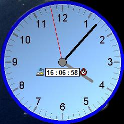

## Analog Alarm Clock

### Description

This is a simple Analog Alarm Clock using the MS Agent Control. There is some advanced coding to make the clock hands working, and to make the form shaped correctly. Has to be seen.
 
### More Info
 
It is assumed that you have the MS Agent control installed and several of the actors. These are all free downloads at http://www.microsoft.com/Msagent/default.asp

             |
---                |---
**Submitted On**   |2006-10-28 16:07:50
**By**             |[Ryan Krawchuk](https://github.com/Planet-Source-Code/PSCIndex/blob/master/ByAuthor/ryan-krawchuk.md)
**Level**          |Intermediate
**User Rating**    |5.0 (15 globes from 3 users)
**Compatibility**  |VB 6\.0
**Category**       |[Complete Applications](https://github.com/Planet-Source-Code/PSCIndex/blob/master/ByCategory/complete-applications__1-27.md)
**World**          |[Visual Basic](https://github.com/Planet-Source-Code/PSCIndex/blob/master/ByWorld/visual-basic.md)
**Archive File**   |[Analog\_Ala20275210282006\.zip](https://github.com/Planet-Source-Code/ryan-krawchuk-analog-alarm-clock__1-66918/archive/master.zip)

